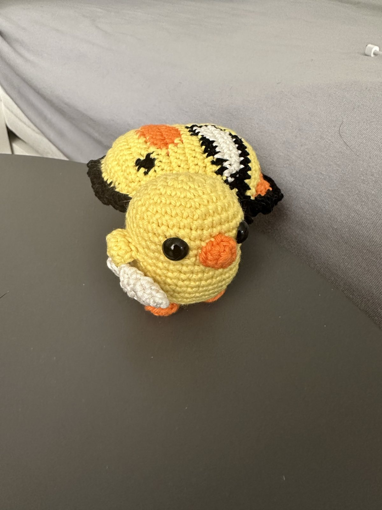
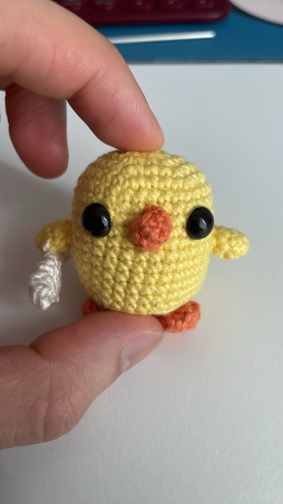
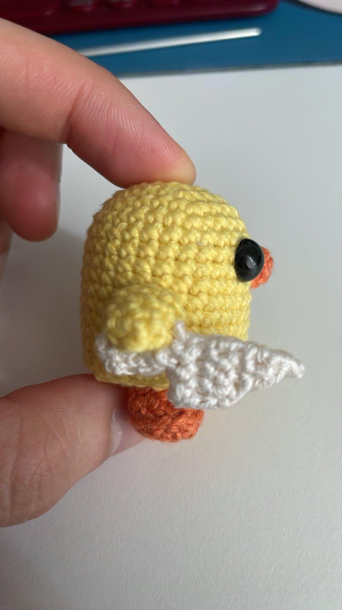

# Peace, was never an option

I made this duck as a gift (or a joke). The reception apparently was extremely positive. I mean, look at it.

{width=75%}

So I'm sharing it.

## Material

Practically you can use any kind of yarn and hook you want and achieve different size of the duck. Here was what I used:

- 2.5mm crochet hook
- Yellow, orange, and white cotton yarn (50g / 170m)
- Safety eyes (I don't remember the correct size but it should cover over 2 rows, or whatever you feel aesthetically pleasing)

## Abbreviations

- sc - single crochet
- inc - increase stitch
- dec - decrease stitch
- MR - magic ring
- ch - chain
- sl - slip stitch
- BLO - backloop only
- FO - fasten off

## Pattern

### Body

|Row|Stitches|Counts||
|---|---|---|---|
|1      |sc x 6 in MR           |(6)    ||
|2      |inc x 6                |(12)   ||
|3      |(sc, inc) x 6          |(18)   ||
|4      |(sc x 2, inc) x 6      |(24)   ||
|5      |(sc x 3, inc) x 6      |(30)   ||
|6-16   |sc x 30                |(30)   |Insert safety eyes between row 8 and 9*|
|17     |BLO (sc x 3, dec) x 6  |(24)   ||
|18     |(sc x 2, dec) x 6      |(18)   |Stuff the duck here|
|19     |(sc, dec) x 6          |(12)   |More stuffing if needed|
|20     |dec x 6, FO            |(6)    |Use needle to weave the tail in|

*I insert the eyes between stitch 11 and 12, and 18 and 19

### Arms (make 2)

|Row|Stitches|Counts||
|---|---|---|---|
|1  |sc x 4 in MR   |(4)||
|2  |(sc, inc) x 2  |(6)||
|3  |sc x 6         |(6)||
|4  |sc x 6, FO     |(6)|Leave a tail to sew arms in|

### Feets (make 2)

|Row|Stitches|Counts||
|---|---|---|---|
|1  |sc x 6 in MR               |(6)    ||
|2  |sc x 2, inc x 2, sc x 2    |(8)    ||
|3  |sc x 3, inc x 2, sc x 3    |(10)   ||
|4  |BLO sc x 3, dec x 2, sc x 3|(8)    ||
|5  |sc x 2, dec x 2, sc x 2, FO|(6)    |Leave a tail to sew feets in|

### Bill

|Row|Stitches|Counts||
|---|---|---|---|
|1  |sc x 3 in MR   |(3)||
|2  |inc x 3, FO    |(6)|Leave a tail to sew bill in|

### Knife (very important)

|Row|Stitches|Counts||
|---|---|---|---|
|   |ch x 3             |   |Turn|
|1  |sc x 2 into ch     |(2)|sl and turn at the end of every row|
|2  |inc x 2            |(4)||
|3  |inc, sc x 2, inc   |(6)||
|4  |inc, sc x 4, inc   |(8)||
|5-6|sc x 8             |(8)|End of knife's edge|
|7  |sl x 3, sc x 2, sl |(2)|2 sc in the middle, turn without sl|
|8  |sc x 2             |(2)||
|9  |sc x 2, FO         |(2)|Leave a long tail*|

*This is 2 sides of the knife, so you have to fold it in half along the back of the knife right in the middle, then sew the edges together.

### Put them all together

- I first sew the bill in between the eyes because that's the easiest.
- Then the arms on the sides, around row 10-11 is perfect
- Feets underneath (duh)
- Knife on either arms, I like the right arm

Some pictures to help you sew them in:

{width=45%} {width=45%}

## Outro

Enjoy! This thing is currently living on my work desk, reminding my colleagues to let me concentrate, or else!
